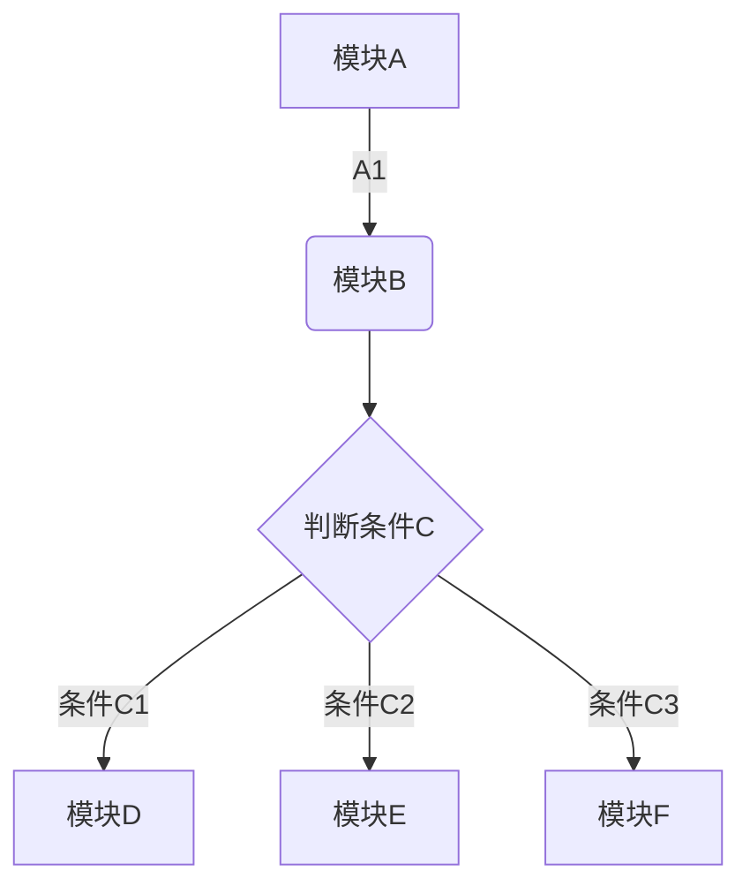
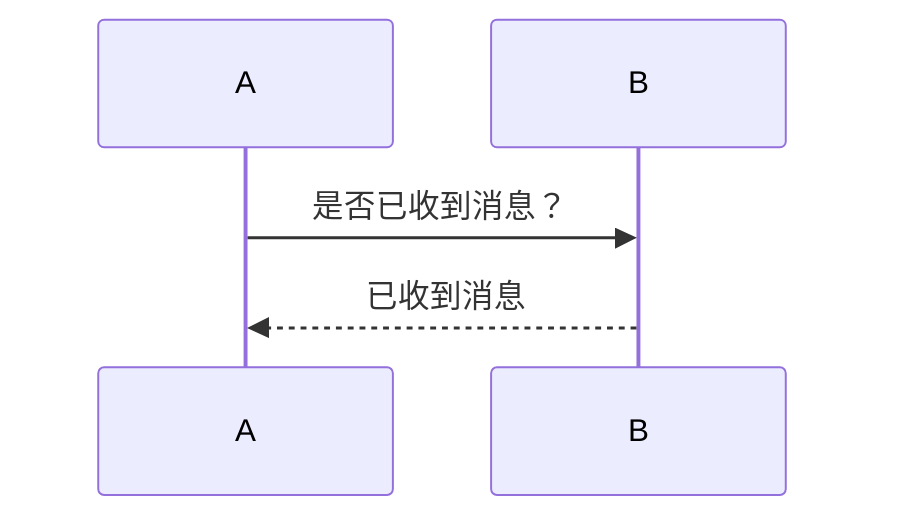
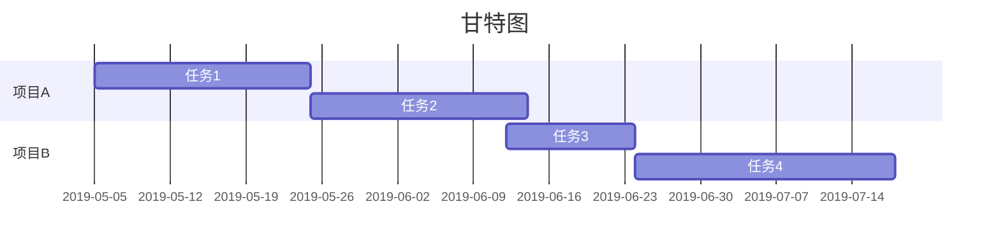

# Markdown使用笔记
[TOC]
## 1.设置分级标题
这是标题的使用前面加1到6个'#'+空格 （行首）表示1到6级标题状态，如
# 一级标题
## 二级
### 三级
#### 四级
##### 五级
###### 六级 最小级别
***
## 2.加粗文本
待加粗文本
**待加粗文本**
***
## 3.斜体
斜体文本内容
*斜体文本内容*
***
## 4.下划线
下划线文本
<u>下划线文本</u>
***
## 5.删除线
删除线文本
~~印象笔记不支持Markdown~~ 文本
~~删除线文本~~ 文本 ~~~三个，三个结束~~~ 结束了
***
## 6.分割线
行首三个*
***
## 7.引用文本
>引用文本引用文本引用文本引用文本，引用文本，引用文本。引用文本引用文本引用文本引用文本引用文本，引用文本
>引用文本！引用文本
***
## 8.添加符号列表或者数字列表
添加符号列表或者数字列表
1. 第一行
2. 第二行
    * 微微
3. 第三条
    * 内容
    * 内容
    * 分类
4. 第四条
5. 第五章
5.1. 第五章第一条
    zhe
5..1.1 第五张第一条第一款
    这些内容和无异议
5.1.2. 测试
    * 这些内容和无异议
    
 6. 第六章

* 第一条
* 第二条
    * 尔尔
    * 散散
        内容 内容 内容 内容 内容 内容 内容 内容 内容 内容 内容 内容
    * 回归
        * 陈词
            内容
        * 长春 
* 第三条
* 
***
## 9.添加待办事项
示例(注意 英文 星号空格空格[ )
* [x] 跑步
* [x]  run
* [ ] 地铁
* [x] 公交
***
## 10.插入链接
插入链接
[Markdown帮助文档（印象笔记）](https://list.yinxiang.com/markdown/eef42447-db3f-48ee-827b-1bb34c03eb83.php)
这里可以书写[数学公式](https://katex.org/docs/supported.html)，用在文本中

## 11.插入图片


插入图片

***
## 12.插入表格
|a| b | c |
|---|---|---|
|a2| b2 | c2 |
|a3| b3 | c 3|
***
## 13.插入图表
饼状图、折线图、柱状图和条形图，只需将 type 改为对应的pie、line、column 和 bar。
```chart 
,预算,收入,支出,债务
1月,5000,8000,4000,6000
2月,3000,3000,5000,2000 ,

type : pie
title: 收支
y.title: 金额
x.title: 月份
y.suffix: $
```

```chart 
,预算,收入,花费,债务
一月,5000,8000,4000,6000
二月,3000,1000,4000,3000
三月,5000,7000,6000,3000
四月,7000,2000,3000,1000
五月,6000,5000,4000,2000
六月,4000,3000,5000,

type: line
title: 每月收益
x.title: 金额
y.title: 月份
y.suffix: $
```
***
## 14.插入行内代码或代码块
```
public class Test {    
    public static void main(String[] args) {       
        int a = 0;        
        if(a++ ==1 || a==2){ 
            System.out.println("ok="+a);        
        }        
        System.out.println("out="+a);    
    }
}
```
***
## 15.插入数学公式
支持LaTeX 数学公式
[数学公式](https://katex.org/docs/supported.html)
```math
e^{i\pi} + 1 = 0
```
```math 
\sum_{\mathclap{1\le i\le j\le n}} x_{ij}
```
***
## 16.插入流程图

****
## 17.插入时序图

***
## 18.插入甘特图

****
## 19.设置目录
[TOC]
部分情况下不支持这种生成目录
****
## 20.字体颜色
$\color{green}{green}$

效果:\color{#4285f4}{G}\color{#ea4335}{o}\color{#fbbc05}{o}\color{#4285f4}{g}\color{#34a853}{l}\color{#ea4335}{e}

写法: 
$\color{#4285f4}{G}
\color{#ea4335}{o}\color{#fbbc05}{o}\color{#4285f4}{g}\color{#34a853}{l}\color{#ea4335}{e}$
****